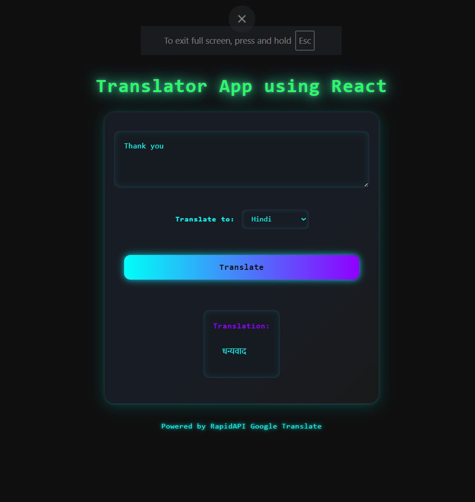

# 🌐 Text Translator App using React

A futuristic, minimal, and fully functional **Text Translator App** built using **React** and styled with **CSS**. This project utilizes the **Google Translate API via RapidAPI** to translate English text into your selected language.



---

## 🚀 Features

- 🔤 **Real-time translation** via RapidAPI (Google Translate)
- 🌈 **Developer-themed UI** with glowing neon elements
- 🧠 Animated heading and dark terminal-style layout
- 📱 Fully **responsive design**
- 🎨 Built using **only HTML, CSS , ReactJS**

---

## ⚙️ Technologies Used

- React
- CSS
- RapidAPI (Google Translate endpoint)

---

## 📁 Project Structure

```
src/
├── App.css
├── App.jsx
├── languages.js
└── main.jsx
```

---

## 🧠 What I Learned

- Using **external APIs** to fetch data in real-time
- Styling with **pure CSS** to achieve futuristic UI (no Tailwind/Bootstrap)
- Working with **React hooks** for input state and async functions
- Improving layout **responsiveness & accessibility**

---

## 📸 Screenshot


---

## 📬 Contact

Created with ❤️ by [Poojan Shrivastav](www.linkedin.com/in/poojanshrivastav21)  
If you like it, feel free to ⭐ the repo!

---

## 🏷️ Tags

`#ReactJS` `#RapidAPI` `#Translator` `#Frontend` `#VanillaCSS` `#GoogleTranslate` `#APIs` `#CSSGlow`
